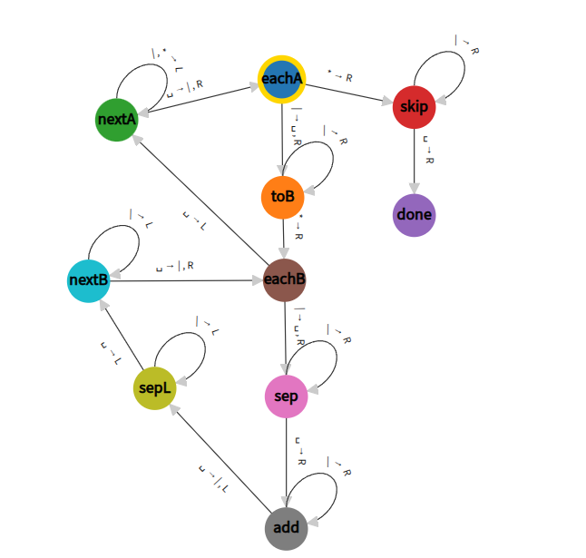

# Cel

>    Lisp is worth learning for [...] the profound enlightenment experience you will have when you finally get it.<br/>
> That experience will make you a better programmer for the rest of your days,even if you never actually use Lisp [...]<br/>
> the same can be said of Haskell, and for very similar reasons.

— Eric S. Raymond, *How to Become a Hacker*

-

> Here's my recipe for programming success: [...] learn at least a half dozen programming languages.<br/ > Include one [...] that emphasizes functional abstraction (like Lisp or ML or Haskell).

— Peter Norvig *Teach Yourself Programming in Ten Years*

-

Ten przedmiot da uczestnikom nowe spojrzenie na programowanie i uczyni ich lepszymi programistami.<br/>

Oczywiście wymaga to zaangażowania i wysiłku.


Przy okazji (trochę) nauczymy się programować w Haskellu.

## Dlaczego Haskell?

Programowanie funkcyjne nie jest już niszą akademicką:

**W przemyśle:**

- React/Redux (Facebook) - funkcyjne zarządzanie stanem
- WhatsApp - Erlang (funkcyjny) obsługuje miliardy wiadomości
- Jane Street - trading wysokich częstotliwości w OCaml
- Shopify - przetwarzanie zamówień w Elixirze
- Blockchain/Smart contracts (Ethereum: Core Solidity, Plutus dla Cardano)

**Umiejętności transferowalne:**

- Myślenie deklaratywne
- Niemutowalne struktury danych
- Kompozycjonalność

Wiele języków imperatywnych włącza elementy funkcyjne.

## Trochę Historii

Chociaż programowanie funkcyjne stało się na szerszą skalę popularne dopiero w tym stuleciu,<br/>
to jego korzenie sięgają stu lat wstecz:

- rachunek kombinatorów (funkcji): Schönfinkel 1924, Curry 1929
- rachunek lambda (funkcji anonimowych): Church 1930
- (można sięgnąć dalej, np. Frege 1893)

W 1928, jako kontynuację swego słynnego programu, David Hilbert wysunął następujący problem:

 > Czy istnieje algorytm, który potrafi odpowiedzieć,
 > czy dana formuła logiczna (pierwszego rzędu) jest prawdziwa?

Aby odpowiedzieć na to pytanie, potrzebna jest formalizacja pojęcia "algorytmu"
i szerzej "obliczalności".
<br />
 W latach 1930-tych zaproponowano dwie takie formalizacje:

- funkcje obliczalne Alonzo Churcha (1935) oraz
- maszyny Turinga (1936).

### Das Entscheidungsproblem - stawki były wysokie!

Hilbert zapytał: "Czy matematyka jest mechaniczna?"

**Gdyby odpowiedź była TAK:**

- Wszystkie twierdzenia matematyczne można by udowodnić algorytmem
- Matematycy staliby się zbędni 😱
- Maszyny mogłyby odkrywać wszystkie prawdy matematyczne

(czy coś Wam to przypomina?)

**Church i Turing pokazali: NIE!**

- Istnieją problemy nierozstrzygalne;
- przy okazji zdefiniowali czym jest "obliczenie"
- oraz dali nam dwa fundamentalnie różne modele myślenia o nim

**Pytanie do zastanowienia:** Gdybyś żył w 1936 i musiał wymyślić "co to znaczy obliczać" -
jak byś to zdefiniował? 🤔

### Podejścia Churcha i Turinga

Dlaczego wszyscy znają Turinga a mało kto Churcha?

- Maszyna Turinga była bliska ówczesnemu rozumieniu maszyn liczących;
- maszynę w której krok obliczenia modyfikuje komórkę pamięci łatwo zrealizowac sprzętowo.
- Łatwiej ją też zrozumieć na niskim poziomie (poszczególnych kroków);
- trudniej jednak ogarnąć w całości jak działa dana maszyna.

### Maszyna Turinga

$M= \langle Q, \Gamma, B, \delta, q_0, F \rangle$
gdzie:

- Q jest zbiorem stanów
- $\Gamma$ jest alfabetem taśmowym
- $B\in \Gamma$ to wyróżniony symbol pusty
<!-- - $\Sigma\subseteq\Gamma\setminus \{B\}$ to alfabet wejściowy -->
- $q_0$ to stan poczatkowy
- $\delta: Q\times\Gamma\to Q\times\Gamma\times\{L,R\}$ to funkcja przejścia<br/>
     w zależności od bieżącego stanu i symbolu na taśmie określa nowy stan i symbol oraz w którą stronę przesuwa się głowica.

### Dodawanie - Maszyna Turinga

Reprezentacja: liczby są zapisane w postaci ciągu jedynek rozdzielonych 0

Wejście: $B1^m01^nB$

Wyjście: $B1^{m+n}BB$


Jak to działa?

### Dodawanie - Maszyna Turinga (intuicja)

**Strategia:** Przekształć `111 0 11` → `11111`

**Algorytm:**

1. Znajdź separator (0)
2. Zastąp go jedynką → teraz mamy `111 1 11`
3. Idź do końca drugiej liczby
4. Usuń ostatnią jedynkę (bo "przesunęliśmy" ją)
5. Wynik: `11111` = 5


Zauważmy: to jest *bardzo* niskopoziomowe

[turingmachine.io](https://turingmachine.io?import-gist=a8874822513d46b5ac0633fec6df1746)


Ćwiczenie: stwórz maszynę dla mnożenia.


### Mnożenie - Maszyna Turinga

<!--
 Wejście: $B0^mC0^nB$; Wyjście: $B0^{m*n}B$

-->

Wejście: $B1^m01^nB$; Wyjście: $B1^{m*n}B$

turingmachine.io (i poniższy screenshot) używają`|,*` zamiast 1,0




### Zagadka

| Stan |  0	 |  1  |
|------|-----|-----|
| A 	 | 1RB | 1LC |
| B 	 | 1RC | 1RB |
| C 	 | 1RD | 0LE |
| D 	 | 1LA | 1LD |
| E 	 | HALT| 0LA |

Co zrobi ta maszyna na pustej taśmie (same 0)?

Wskazówka: 47 176 870

## Zagadka

| Stan |  0	 |  1  |
|------|-----|-----|
| A 	 | 1RB | 0LD |
| B 	 | 1RC | 0RF |
| C 	 | 1LC | 1LA |
| D 	 | 0LE | HALT|
| E 	 | 1LF | 0RB |
| F    | 0RC | 0RE |

Co zrobi ta maszyna na pustej taśmie (same 0)?

Wskazówka: 10^^15

## Problem z maszyną Turinga

**Eksperyment myślowy:** Napisz MT, która sprawdza czy liczba jest pierwsza.

Potrzebujesz:

- Stanów na pętlę zewnętrzną (dzielniki)
- Stanów na pętlę wewnętrzną (dzielenie)
- Stanów na porównania
- Stanów na kopiowanie liczb w pamięci...

**Wynik:** Setki stanów dla prostego algorytmu! 😱

**Kierunki rozwiązań:**

- von Neumann/Princeton: imperatywnie ale na wyższym poziomie (C, Java,Python)
- Church: rachunek funkcji (λ, kombinatory)
- hybrydowe: funkcyjne na wysokim poziomie, kompilacja na instrukcje niskiego (Haskell)

## Od Turinga do Church'a - zmiana perspektywy

**Maszyna Turinga (imperatywna):**
```
STAN: A, TAŚMA: [1,1,0,1,_,_], POZYCJA: 3
  ↓ (wykonaj krok)
STAN: B, TAŚMA: [1,1,1,1,_,_], POZYCJA: 4
  ↓ (wykonaj krok)
...
```

**Rachunek funkcji (deklaratywna):**

"2" to operacja zastosowania funkcji dwa razy:
```
   2 f x = f(f(x))
```
"dodaj 2 i 3" to:
```
   (2+3) f x = 2 f (3 f x)
             = f(f(f(f(f(x)))))
             = 5 f x
```

**Kluczowa różnica:**

- MT: *jak* coś obliczyć krok po kroku
- Church: *czym* jest wynik jako przekształcenie

## Arytmetyka - rachunek funkcji

Podstawowa konstrukcja: zastosowanie funkcji do argumentu  - `f(x)` albo krócej: `f x`

**Liczby naturalne -  idea:** liczba n jest reprezentowana przez n-krotne powtórzenie funkcji

$$ n\ s\ z = s^n z $$

np. $2\ s\ z = s(s\ z)$


**Inna notacja:** $\lambda x.e$ (Javascript: `(x)=>e`)

$$2 = \lambda s.\lambda z.s(s\ z)$$

$$2 = \lambda s\ z.s(s\ z)$$

Tekstowo:

``` haskell
two = \s z -> s(s z)
```

albo
``` haskell
two s z = s(s z)
```

W Javascript napisalibyśmy

```
const two = (s, z) => s(s(z))
```

## Arytmetyka - dodawanie

Dodawanie: $$(m + n)\ s\ z = m\ s(n\ s\ z)$$
<!--
$$(+) = \lambda\ m\ n\ f\ x . m\ f(n\ f\ x)$$

$$2 + 1 = \lambda f x.2 f(1 f x) = \lambda f x.2 f (f x) =
\lambda f x. f(f (f x)) = 3$$
-->

Na przykład:

$$(2 + 1)\ s\ z = 2\ s\;(1\ s\ z) = 2\ s\; (s\;z) =s(s(s\; z))  = 3\; s\; z$$

albo:

```
   (2 + 3) f x = 2 f (3 f x)
             = f(f(f(f(f(x)))))
             = 5 f x
```


## Arytmetyka - mnożenie (z intuicją)

Mnożenie: $(m * n)\ f\ x = m (n\ f) x$

**Rozbicie na etapy - mnożenie 3 × 2:**

```haskell
-- Chcemy: 3 × 2 = 6
-- Czyli: zastosuj f sześć razy

-- Krok 1: Co to znaczy "2"?
2 f x = f (f x)           -- zastosuj f dwa razy

-- Krok 2: Co to znaczy "3"?
3 g y = g (g (g y))       -- zastosuj g trzy razy

-- Krok 3: Mnożenie
3 × 2 = λf.λx. 3 (2 f) x
      = λf.λx. (2 f) ((2 f) ((2 f) x))
      = λf.λx. f(f(f(f(f(f(x))))))
      = 6
```

**Intuicja:** "3*2" = "3 grupy po 2 aplikacje f" = 6 aplikacji f

(na marginesie: "m*n" to złożenie funkcji m i n)

Idąc dalej tym tropem można zdefiniować potęgowanie, test na zero,<br/>
rekurencję (iteracja jest zakodowana przez same liczby).<br/>

W efekcie możemy zdefiniować każdą funkcję obliczalną.


## Kombinatory

Kombinator to funkcja, która "kombinuje" swoje argumenty, np.

``` haskell
I x = x
two f x = f (f x)
add m n f x = m f (n f x)
```

<!-- Z kolei `four = add two two` jest kombinatorem o ile `add` i `two` potraktować jako stałe (zostały wcześniej zdefiniowane). -->

Fundamentalne odkryciem Schönfinkela było, że każdy kombinator da się wyrazić przy pomocy tych dwóch: 🤯

``` haskell
S x y z = x z (y z)
K x y = x
```
na przykład

``` haskell
I = S K K              -- S K K z = K z (K z) = z = I z
two = S (S (K S) K) I
```

oczywiście programowanie w ten sposób jest podobnie niewygodne jak maszyny Turinga, lepiej

``` haskell
B x y z = x(y z)       -- B = S (K S) K
one = I
succ = S B
add = B S (B B)
```
...a jeszcze lepiej dopasować zestaw kombinatorów do potrzeb.

Uwaga notacyjna: z wielkiej litery piszę tu kombinatory "historyczne".
W Haskellu poczet liter ma inne znaczenie.


### Kombinatory i ich argumenty

**K** *(Konstanzfunktion, producent funkcji stałych)*

```
K x y = x
```
- `K` bez argumentów nie redukuje się
- `K x` - też ma za mało argumentów, ale reprezentuje funkcję stałą `f(y) = x`
- `K x y = x` - dokładnie dwa argumenty!
- `K x y z = (K x y) z = x z` - dwa pierwsze argumenty uzyte, reszta zostaje

**S** *(VerSchmelzungsfunktion, sklejacz/rozdzielacz)*

```
S f g x = f x (g x)    -- przekaż x zarówno do f jak i g
```
Przykład:
```
S (+) (*2) 3 = (+) 3 ((*2) 3)
             = 3 + 6
             = 9
```

W tym sensie S jest rozdzielaczem, Schönfinkel widział sklejenie: `f x(g x) = S f g x`

### Rachunek lambda

Kombinatory są funkcjami nazwanymi, podobny efekt można uzyskać używając funkcji anonimowych

$$ M ::= x \mid M(M) \mid \lambda x.M $$

Reguła obliczenia (tzw. beta-redukcja):

$$ (\lambda x.M)N \to M[N/x] $$

gdzie $M[N/x]$ oznacza term $M$, w którym wolne wystapienia $x$ zastąpiono przez $N$

na przykład

$$ (\lambda x.\lambda y.x)(\lambda x.x) \to (\lambda y.x)[(\lambda x.x)/x] = \lambda y.\lambda x. x $$

Uwaga: trzeba pilnować zmiennych związanych przez $\lambda$ i w razie potrzeby zmieniać im nazwy (tzw. $\alpha$-konwersja):

$$ (\lambda y.x)[y/x] \stackrel{\alpha}{=} (\lambda z.x)[y/x] = \lambda z.y $$

W Haskellu przeważają funkcje nazwane, ale możemy też używać anonimowych.

## Programowanie całościowe
Oczywiście tak w językach imperatywnych jak i funkcyjnych używamy arytmetyki maszynowej.<br />
Języki imperatywne bliższe są też modelowi von Neumanna (adresowalne komórki pamięci zamiast taśmy)

Tym niemniej ogólna zasada pozostaje:

**w programowaniu funkcyjnym patrzymy bardziej na całe obliczenie niż na poszczególne kroki.**

Suma i iloczyn listy funkcyjnie:
``` haskell
sum = fold 0 (+) list
product = fold 1 (*) list
```

Suma i iloczyn listy imperatywnie:
``` c
while(list) {
  sum += list->head;
  list = list->tail;
}
while(list) {
  prod *= list->head;
  list = list->tail;
}
```

**Ćwiczenie:** ile problemów znajdziesz w powyższym kodzie C/C++?

### Programowanie całościowe - więcej przykładów

**Imperatywnie (myślenie krok-po-kroku):**
```python
# Znajdź pierwsze 10 liczb parzystych większych od 100
def even_more():
    result = []
    n = 101
    while len(result) < 10:
        if n % 2 == 0:
            result.append(n)
        n += 1

    return result
```

**Funkcyjnie (myślenie deklaratywne):**
```haskell
-- "Weź liczby od 101, filtruj parzyste, weź pierwszych 10"
evenMore = take 10 $ filter even [101..]
```

**Co zyskujemy?**

- Kod brzmi jak specyfikacja
- Brak niepotrzebnych zmiennych tymczasowych (`result, n`)
- Łatwo modyfikować (`take 20`, `odd`, itp.)
- Można łatwo wykonać równolegle
- Mniej błędów (brak mutacji stanu)

**Cena?**
- Trzeba myśleć inaczej (ale warto! 💪)


### Ale przecież w Pythonie można...

```haskell
-- "Weź liczby od 101, filtruj parzyste, weź 10 pierwszych"
take 10 $ filter even [101..]
```

Python ma konstrukcje "deklaratywne" (zapożyczone z Haskella), ale czy to zadziała?
...i czy jest tak samo czytelne?

``` python
list(itertools.islice([x for x in itertools.count(101) if x % 2 == 0  ], 0, 10))
```

(loop)

A to?

``` python
list(itertools.islice(filter(lambda x: x % 2 == 0, itertools.count(101)), 0, 10))
```

a dlaczego nie to?

``` python
filter(lambda x: x%2 == 0, itertools.count(101))[:10]
```

(crash)

## Instrukcje i wyrażenia

W programowaniu imperatywnym, tak jak i w maszynach Turinga i von Neumanna, centralnym pojęciem jest instrukcja: w jaki sposób zmienić stan maszyny.

W programowaniu funkcyjnym, centralnym pojęciem jest wyrażenie, opisujące pewną wartość.

Wyrażenia mogą zawierać nazwy dla wartości, potocznie nazywane zmiennymi.

Uwaga: słowo zmienna jest tu użyte w znaczeniu matematycznym (jak "funkcja jednej zmiennej"),
<br/>a nie znanej z programowania imperatywnego (jak "zwiększ wartość zmiennej o 1").

### Zasada przejrzystości

Wartość wyrażenia zależy tylko od wartości jego części składowych;<br/> zastąpienie części wyrażenia innym wyrażeniem o tej samej wartości daje równoważne wyrażenie.

Konsekwencja: podwyrażenia mogą być obliczane w dowolnej kolejności, a nawet równolegle.

O wyrażeniach funkcyjnych możemy wnioskować przy użyciu zwykłych reguł matematycznych

$$ \forall x .f(x)+f(x) = 2f(x) $$

W językach imperatywnych tak nie jest - wyrażenia mogą zmieniać stan maszyny; mówimy wtedy o efektach ubocznych.

Do kwestii efektów jeszcze wrócimy - czasami efekty są wręcz pożądane (np. I/O).

### Weryfikacja

Dzieki zasadzie przejrzystości łatwiej dowodzić własności programów, np.

``` haskell
filter p . filter q = filter (p && q)
filter p . concat = concat . map(filter p)
filter p (xs ++ ys) = filter p xs ++ filter p ys
```
a także używać ich do usprawniania programów.

# Haskell

Dziś obejrzymy język Haskell "z lotu ptaka"<br/>
- pobieżnie omówimy najważniejsze pojęcia i konstrukcje, będziemy je rozwijać na kolejnych wykładach.

## Haskell

Nazwa — pochodzi od imienia pioniera rachunku kombinatorów: **Haskell Brooks Curry** (1900–1982)

Czysty język funkcyjny

- Bez efektów ubocznych (ukrytych)
- Ułatwia wnioskowanie o programach

Leniwy (dokładniej: pobłażliwy, ang. *non-strict*)

- Wyrażenia nie są obliczane wcześniej niż potrzeba
- Umożliwia programowanie z (potencjalnie) nieskończonymi strukturami
- Daje pełną kompozycjonalność (`take 3 . filter good . candidates`)

Zaprojektowany w latach 1990-tych, od tego czasu do dziś intensywnie rozwijany<br />
 (Haskell Report 1.0 1990; Haskell 98 - 2002;  Haskell 2010; oraz de facto GHC2021; GHC2024)

## Struktura programu

* Program w Haskellu składa się z *modułów*
* Moduły zawierają *deklaracje*
* Najważniejszą formą deklaracji są *definicje* funkcji
* Centralną rolę w takich definicjach grają *wyrażenia*

**W Haskellu nie ma instrukcji takich jak znamy z innych języków (np. przypisania).**

- oprócz definicji funkcji także deklaracje typów, klas, itp.

## Interpreter

Haskell jest zasadniczo językiem kompilowanym (podobnie jak C), ale istnieje też interpreter: `ghci`


W interpreterze możemy wczytać plik z definicjami i obliczać wartości wyrażeń.


```
$ ghci
GHCi, version 9.8.4: https://www.haskell.org/ghc/  :? for help

ghci> 2 * 2
4
ghci> :load square.hs
[1 of 1] Compiling Main             ( square.hs, interpreted )
Ok, one module loaded.
ghci> square 3
9
```
Możemy też załadować cały projekt:

```
$ cabal repl
...
Ok, 51 modules loaded.
ghci> import Solcore.Primitives.Primitives
ghci> snd primAddWord
Forall [] ([] :=> TyCon -> [TyCon word [],TyCon -> [TyCon word [],TyCon word []]])
ghci> pretty it
"word -> word -> word"
```

## Kompilator

Program, który zawiera funkcję `main` możemy skompilować do pliku wykonalnego:

``` shell
$ cat answer.hs
main = print 42

$ ghc answer.hs
[1 of 1] Compiling Main             ( answer.hs, answer.o )
Linking answer ...

$ ./answer
42
```
albo cały projekt
```
$ cabal build
Configuration is affected by the following files:
- cabal.project.local
Build profile: -w ghc-9.8.4 -O1
In order, the following will be built (use -v for more details):
 - sol-core-0.0.0.0 (lib) (configuration changed)
 - sol-core-0.0.0.0 (exe:yule) (dependency rebuilt)
 - sol-core-0.0.0.0 (exe:sol-core) (dependency rebuilt)
 - sol-core-0.0.0.0 (test:sol-core-tests) (dependency rebuilt)
...
[40 of 51] Compiling Solcore.Frontend.Parser.SolcoreParser
...
[3 of 3] Linking .../build/sol-core-tests/sol-core-tests [Library changed]
```

### Czy Haskell jest wolny?

Czy Haskell jest wolniejszy niż C?

Tak ale nie bardzo. 30 lat temu tak było, ale teraz GHC jest bardzo dobrym kompilatorem.

Przykład benchmarku (benchmarksgame-team.pages.debian.net)

```
binary-trees

source 	       secs 	 mem 	    gz 	cpu secs
Rust #5        1.09 	198,720 	771   3.84
C clang #2     1.66 	170,236 	816   5.36
Haskell GHC #4 2.06 	271,032 	807   5.24
Java  #7       2.62   1,803,192 	841   8.14
Node.js #6     8.60   1,250,816 	752  30.68
Go #2         14.17 	624,780 	672  56.29
Swift #4      17.49 	707,456 	772  55.84
Python 3 #4   33.61 	276,992 	481 121.96
```

Czy Haskell jest wolniejszy niz Java/Python?

NIE, zwykle jest szybszy :)

### Czy programowanie w Haskellu wymaga teorii kategorii?

W Internecie mozna znaleźć "paragony grozy" typu:

> Costate Comonad Coalgebra is equivalent of Java member variable update technology for Haskell

`- @PLT_Borat`

albo

>  A monad is just a monoid in the category of endofunctors, what's the problem?

Pewne działy matematyki są istotnie przydatne w bardzo zaawansowanym programowaniu, ale na co dzień nie są potrzebne.

Haskell jest oczywiście zupełnie inny niż np. Java, ale przekonamy się, że nie jest trudniejszy niż dajmy na to C++:

> The lambda expression is a prvalue expression of unique unnamed non-union non-aggregate class type, known as closure type, which is declared (for the purposes of ADL) in the smallest [...] scope that contains the lambda expression.

> A prvalue is an expression whose evaluation
computes the value of an operand of a built-in operator, or initializes an object.

> [cppreference.com]

## Użycie funkcji

Podstawową rzeczą, którą możemy zrobić z funkcją,
jest wyznaczenie jej wartości dla danych argumentów;<br/>
mówimy wtedy o zastosowaniu (aplikacji) funkcji do argumentów.

(za chwilę przekonamy się dlaczego nie mówimy o wywołaniu funkcji).

```
ghci> not True
False
ghci> min 2 3
2
```

zauważmy, że piszemy raczej `f x y` niż `f(x,y)` - później wyjaśnimy dlaczego.

Oczywiście funkcje mogą być argumentami i wynikami innych funkcji.

Funkcje są wartościami podobnie jak liczby, jednak (w ogólności) nie możemy ich wypisać.

## Funkcje i definicje

Definicja funkcji mówi, jaka jest jej wartość dla danych argumentów:

``` haskell
square x = x * x
twice f x = f(f x)
```

Samo zastosowanie funkcji nie wymaga nawiasów, ale są one potrzebne jeśli argument jest wyrażeniem złożonym.

Możemy definiować "funkcje 0-argumentowe", czyli stałe:
``` haskell
answer = 40 + 2
```

Definicje zapisujemy w pliku, który możemy załadować do interpretera lub skompilować.

W interpreterze można tworzyć proste (zasadniczo jednolinijkowe) definicje ad-hoc, ale nie jest to zalecane.


### Formy definicji

Definicja może zawierać warunki (guards):
``` haskell
mn x y | x <  y = x
       | x >= y = y
```

może też zawierać definicje pomocnicze

``` haskell
f x y | x < a     = x + a
      | otherwise = x - a       -- warunki są sprawdzane kolejno, pierwszy spełniony wygrywa
      where
        a = square(y+1)
        square x = x * x
```

NB zasięgiem definicji w `where` są wszystkie gałęzie warunkowe.

## Rekurencja

Definicje mogą być rekurencyjne

``` haskell
fact n | n <= 1 = 1
       | n > 1  = n * fact(n-1)
```
W programowaniu funkcyjnym rekurencja jest podstawowym mechanizmem sterowania (nie ma instrukcji, zatem nie ma `while`).

Definicje mogą być wzajemnie rekurencyjne, dlatego możemy je pisać w dowolnej kolejności.

## Obliczenia
Obliczenie wartości wyrażenia polega na redukowaniu (upraszczaniu) wyrażenia aż do uzyskania postaci kanonicznej.

```
square x = x * x
```

Spójrzmy na wyrażenie `square(3+4)`; jedna z możliwych redukcji

```
square (3+4) = { + }
square 7     = { square }
7 * 7        = { * }
49
```
Wyrażenie "49" nie da się zredukować - jest ono wartością (jest w postaci normalnej).

## Kolejność ewaluacji
Dla większości wyrażeń
możliwe są różne kolejności obliczeń.

 Inną możliwością obliczenia `square(3+4)` jest
```
square (3+4)  = { square }
(3+4) * (3+4) = { + }
7 * 7         = { * }
49
```

Większość języków oblicza wartości argumentów przed przekazaniem ich do funkcji; <br />
kolejność obliczania składowych wyrażenia może mieć wpływ na jego wartość.

W Haskellu (przejrzystość!), jeśli dwie kolejności obliczeń prowadzą do wyniku, <br /> to dadzą ten sam wynik.

## Kolejność ewaluacji
Jeśli dwie strategie (kolejności) obliczeń prowadzą do wyniku, to dadzą ten sam wynik.

Natomiast może się zdarzyć, że niektóre strategie nie prowadzą do wyniku (błąd, zapętlenie).

Dlatego Haskell nie oblicza wartości argumentów przed przekazaniem ich do funkcji  <br />
jeżeli nie jest to niezbędne.

``` haskell
ghci> k x y = x
ghci> k "OK"  (error "crash!")
"OK"
```
Haskell: **OK**;  ML, Scala, C: `crash!`

Domyślna strategia  w Haskellu (tzw. strategia normalna) ma tę własność, <br />
że jeśli jakaś strategia obliczeń prowadzi do wyniku, to normalna też.

Strategia normalna wykonuje najpierw najbardziej zewnętrzną redukcję (leftmost-outermost)

## Wartość nieokreślona

Obliczenia mogą nie prowadzić do wyniku (błąd, zapętlenie).

Aby jednak zachować zasadę, że każde poprawne wyrażenie opisuje jakąś wartość, <br />
czasami wprowadza się "wartość nieokreśloną": $\bot$ (tzw. pinezka, ang. *bottom*).

Dokładniej, wartością wyrażenia jest $\bot$,<br />
 jeśli jego obliczenie w porządku normalnym prowadzi do błędu lub zapętlenia.

W Haskellu taką wartość mają np

``` haskell
bottom1 = undefined
bottom2 = error "some message"
bottom3 = bottom3
```

## Funkcje rygorystyczne i pobłażliwe

Jeśli $f(\bot) = \bot$, mówimy że funkcja $f$ jest *rygorystyczna*  albo *pedantyczna* (ang. *strict*).

W przeciwnym wypadku mówimy, że jest *pobłażliwa*  (ang. *non-strict*).

W wypadku funkcji wieloargumentowej możemy mówić, ze funkcja jest rygorystyczna ze względu na któryś argument.

Rozważmy na przykład funkcje

``` haskell
id x = x
const x y = x
```

Funkcja `id` jest rygorystyczna.

Funkcja `const` jest rygorystyczna dla pierwszego argumentu, ale pobłażliwa dla drugiego:

``` haskell
id undefined = undefined
const undefined y = undefined
const x undefined = x
```

<!--
Nie jest jednak w pełni rygorystyczna:
$\quad const(\bot) = \lambda y.\bot \neq \bot$
-->

Gorliwa (eager) ewaluacja (najpierw argumenty) daje funkcje pedantyczne.<br/>
Leniwa (lazy) ewaluacja (dopiero kiedy trzeba) pozwala na funkcje pobłażliwe.

## Listy

Listy są popularną strukturą danych. W Haskellu na tyle ważną, że będzie o nich osobny wykład.

Sposoby tworzenia list:

``` haskell
[1,3,5,7,9]
[0..4]
[1,3..9]
[2*n+1 | n <- [0..4]]
0:[1,2,3]  -- (head:tail)
```

Napisy są listami znaków:

```
ghci> ['a'..'h']
"abcdefgh"
```

Na laboratorium poznamy funkcje na listach takie, jak:

```
(++),  take,  drop,  concat, reverse, words, unwords, filter, ...
```


## Strumienie

Jedną z ciekawych możliwości, jakie daje leniwa ewaluacja jest programowanie z (potencjalnie) nieskończonymi strukturami danych.<br/>
 Jedną z takich struktur są strumienie, czyli leniwe listy.

Możemy na przykład zdefiniować strumień wszystkich liczb naturalnych:

```
> nats = [0..]
> few = take 5   -- weź pięć pierwszych elementów
> few nats
[0,1,2,3,4]
```
Potem możemy wybrać ze strumienia  tylko parzyste:

```
> evens = [x | x <- nats, even x]
> few evens
[0,2,4,6,8]
> evens !! 444_444
888888

> odds = [x+1 | x <- evens]
> few odds
[1,3,5,7,9]
```

## Strumienie - ciekawsze przykłady

Fibonacci: lista, która zjada swój własny ogon

``` haskell
fibs = 0 : 1 : zipWith (+) fibs (tail fibs)

-- Weź 10 pierwszych:
take 10 fibs  -- [0,1,1,2,3,5,8,13,21,34]

-- 1000-ną:
fibs !! 1000  -- obliczone natychmiast!
```

Liczby pierwsze:

```haskell
sieve (p:xs) = p : sieve [x | x <- xs, x `mod` p /= 0]
primes = sieve [2..]

take 10 primes  -- [2,3,5,7,11,13,17,19,23,29]
```

## Typy

Każde (poprawne) wyrażenie ma typ. <br />
Typ wartości jest pewną klasą abstrakcji: <br /> wskazuje własności wspólne dla wartości tego typu.

Na najniższym poziomie, komputery operują na ciągach bitów.
<br />
System typów pozwala na tworzenie abstrakcji - nadaje nowe znaczenia ciągom bitów  <br />
(to jest adres, to jest liczba, to jest numer rezerwacji).

Haskell ma *silne typowanie* - typy nie zmieniają się w trakcie obliczeń (nie ma rzutowań).

Typy są wyprowadzalne - interpreter/kompilator potrafi odtworzyć typ dowolnego wyrażenia.
<br />
W zwiazku z tym deklarowanie typów funkcji nie jest obowiązkowe, ale jest użyteczną dokumentacją (sprawdzaną przez kompilator!)

W ghci możemy zapytać o typ dowolnego wyrażenia

```
ghci> :type words "a b c"
words "a b c" :: [String]
ghci> :t words
words :: String -> [String]
ghci> :type (+)
(+) :: Num a => a -> a -> a
ghci> :type +d (+)
(+) :: Integer -> Integer -> Integer
```

### Dlaczego typy? (praktycznie)

**Typy = automatyczna dokumentacja + weryfikacja**

Bez typów (Python/JavaScript):
```python
def process(data, config, debug):
    # Co to jest data? Lista? Dict? String?
    # Co to jest config? Opcjonalny?
    # debug to bool? String? Int (0/1)?
    ...
```

**Z typami (Haskell):**
```haskell
type Debug = Bool
process :: [User] -> Maybe Config -> Debug -> Result
--           ↑           ↑             ↑         ↑
--         lista     może być       True/False  zwraca
--         userów    niezdefiniowane            Result
```

**Korzyści:**

- ✓ **IDE wie** co można zrobić z argumentami
- ✓ **Kompilator wykryje** błędy PRZED uruchomieniem
- ✓ **Kolega z zespołu wie** jak użyć funkcji
- ✓ **Refactoring jest bezpieczny** (zmiana typu → wszystkie użycia muszą się zgadzać)

### Przykład z życia:
```haskell
-- Ta funkcja NIE SKOMPILUJE SIĘ jeśli zwróci Nothing
getUserEmail :: UserId -> Email  -- MUSI zwrócić Email

-- Ta funkcja może nie znaleźć użytkownika
findUser :: UserId -> Maybe User  -- Jasno komunikuje: może być Nothing
```

## Typy funkcji
Argumenty do funkcji przekazujemy "po jednym", na przykład `mn x y`.<br/>
W wyrażeniu `f(x,y)` argumentem funkcji `f` jest para `(x,y)`. <br/>
Oczywiście krotki mogą być argumentami funkcji, ale pamiętajmy, że `f(x,y)` to nie to samo co `f x y`

Znajduje to odbicie w typach funkcyjnych
```haskell
mn :: Int -> Int -> Int
```

Typ `Int -> Int -> Int` jest równoważny `Int -> (Int -> Int)` <br />
i oznacza funkcję, która dostawszy argument typu `Int` daje w wyniku funkcję `Int -> Int`.

Z kolei `(Int -> Int) -> Int` to typ funkcji, której argumentami są funkcje `Int -> Int`.

Analogicznie `mn x y` jest równoważne `(mn x) y`
ale czym innym niż `mn(x y)`!

Tym niemniej potocznie mówimy że "funkcja jest n-argumentowa".<br/>
W rzeczywistosci redukcja aplikacji odbywa się tylko gdy jest odpowiednia liczba argumentów.
<br/> (czyli w naszym przykładzie `mn 0` się nie redukuje, dopiero `mn 0 3`)

## Typy polimorficzne

Niektóre funkcje mogą działać dla argumentów różnych typów - czyli mogą mieć więcej niż jeden typ; na przykład identyczność

``` haskell
id x = x
```

wyrażamy to przy pomocy tzw. zmiennych typowych

``` haskell
id :: a -> a
```

Należy to rozumieć tak, że identyczność ma typ `a -> a` dla dowolnego typu `a`.


Wartość nieokreślona i błąd są dowolnego typu:

``` haskell
undefined :: a
error :: String -> a
```

**Uwaga:** `undefined` to coś całkiem innego niż w Javascript, mniej więcej

``` haskell
undefined = error "undefined"
```

## Definiowanie typów

Możemy definiować własne typy danych, np.:

- `data Color = Red | Green | Blue`
- `data ExitCode = ExitSuccess | ExitFailure Int`

Typy mogą być rekurencyjne

- `data Nat = Zero | Succ Nat`

... i polimorficzne

- `data Maybe a = Nothing | Just a`
- `data Tree a = Empty | Node a (Tree a) (Tree a)`

Funkcje operujące na takich typach możemy definiować przez przypadki (dopasowanie wzorca)

``` haskell
add m Zero = m
add m (S n) = S (add m n)
```

Typom poświęcony będzie następny wykład.

## Klasy typów
Czasami jakaś operacja ma sens dla więcej niż jednego typu;<br />
np. dodawanie dla `Int`, `Double` itp.

W Haskellu jest to zrealizowane przy pomocy *klas typów*<br/>
 - zbiorów typów, które mają wspólny interfejs (ale być może zupełnie inne implementacje).

``` haskell
(+) :: Num a => a -> a -> a
```

Rozumiemy to tak, że dodawanie jest przeciążone
i ma typ `a -> a -> a`
dla dowolnego typu `a` należacego do klasy `Num`<br/>
(czyli realizującego interfejs `Num`).

Także literały liczbowe są przeciążone

``` haskell
0 :: Num a => a
3.14 :: Fractional a => a
```

Klasy typów omówimy dogłębnie na jednym z kolejnych wykładów.

## Przejrzystość

Haskell jest językiem czystym, w którym obowiązuje zasada przejrzystości:

* każde obliczenie wyrażenia daje ten sam wynik
* zastąpienie wyrażenia innym wyrażeniem o tej samej wartości daje równoważny program

Na przykład

* `let x = 2 in x+x` jest równoważne `2+2`
* `let f x = x + x in f 2` jest równoważne `2+2`
* `let x = g 2 in x + x` jest równoważne `g 2 + g 2` dla dowolnej funkcji g (odpowiedniego typu).


### Efekty uboczne
Sytuacja komplikuje się w obecności efektów ubocznych, np. I/O.
<br/>
Powiedzmy, że mamy funkcję `readInt :: Handle -> Int` wczytującą liczbę ze strumienia (np. `stdin`). Czy

```
let x = readInt stdin in x+x
```
jest równoważne `readInt stdin + readInt stdin` ?

Efekty uboczne są w konflikcie z zasadą przejrzystości.
<br/>
Różne języki rozwiązują to na różne sposoby, z reguły rezygnując z przejrzystości.
<br/>
W ML niektóre funkcje nie są przejrzyste. W C prawie żadne funkcje nie są przejrzyste.

### Czystość jest bliska boskości
W Haskellu przejrzystość jest zasadą nadrzędną, dlatego<br />
 **nie może** być funkcji takiej jak `readInt :: Handle -> Int`.<br />

Funkcja spełniająca podobną rolę będzie miała typ `Handle -> IO Int`.

Różnica wydaje się kosmetyczna, ale jest w istocie fundamentalna:

- wyrażenie `readInt stdin` nie daje teraz
wartości typu Int, ale **obliczenie**,<br />
 którego wykonanie da wartość typu `Int` (przepis na uzyskanie wartości typu `Int`);
- dzięki temu zachowujemy przejrzystość - każde wywołanie da takie samo obliczenie (wczytaj liczbę z stdin).
- system wykonawczy uruchamia obliczenie stanowiące wartość funkcji `main`

``` haskell
k x y = x
main = k (print "foo") (print "bar")
```

# Podsumowanie
- Programowanie funkcyjne opiera się na innym sposobie rozumienia obliczeń
- Rachunek funkcji zamiast maszyny stanowej
- Haskell - czysty język funkcyjny
- Zasada przejrzystości:
    - wartość wyrażenia zależy tylko od wartości jego części składowych;
    - zastąpienie części wyrażenia innym wyrażeniem o tej samej wartości daje równoważne wyrażenie;
    - ułatwia całościowe patrzenie na programy i wnioskowanie.
- Leniwa ewaluacja:
    - wyrażenia nie są obliczane wcześniej niż potrzeba;
    - umożliwia programowanie z (potencjalnie) nieskończonymi strukturami,
    - daje pełną kompozycjonalność
- Bogaty system typów
    - polimorfizm, typy algebraiczne, klasy typów
    - interpreter/kompilator potrafi odtworzyć typ dowolnego wyrażenia.

# Organizacja

## Plan wykładu

1. Wstęp
2. Typy
3. Klasy
4. Studium przypadku: liczby naturalne, listy
5. Real World Haskell: I/O, moduły, cabal
6. Lenistwo, strumienie
7. Wyższe klasy Functor, Applicative,
8. Monady
9. Foldable/Traversable
10. Wnioskowanie o programach
11. Testowanie
12. Tour de force: soczewki (Costate Comonad Coalgebra...)

## Laboratorium

Celem laboratorium jest przećwiczenie koncepcji z wykładu pod kierunkiem prowadzącego,<br/>
wyjaśnienie niejasności (oraz oczywiście eksperymentowanie).

Częściowo w formule "reverse classroom":<br/>
do wielu tematów jest umyślnie więcej zadań niż da się zrobić w 90 minut;<br/>
pozostałe należy zrobić we własnym zakresie,<br/>
w razie problemów zwrócić się do prowadzącego na kolejnych zajęciach.

<!--
Tym niemniej nie należy traktować laboratorium tylko jak konsultacji;<br/>
nieobecność utrudni zaliczenie przedmiotu.
-->

W ramach laboratorium także wyjaśnianie zadań zaliczeniowych.

## Materiały


* Materiały na https://moodle.mimuw.edu.pl
* Zadania oddajemy przez moodle (i omawiamy z prowadzącym)
* Klucz dostępu `PF25g#0n` - gdzie n = numer grupy (np. `PF25g#09`)
* Strona zapasowa https://github.com/mbenke/pf26

## Zasady zaliczania

- trzy zadania zaliczeniowe - tekstowa wizualizacja procesu ewaluacji:
  * T2-T3 (2-15.3) ustalone kombinatory  (S, K, ...)
  * T4-T7 (16.3-12.4) kombinatory definiowane przez użytkownika (pico-Haskell)
  * T8-T13 (13.4-7.6) toż + dopasowanie wzorca
- zadania muszą być oddane przez moodle w wyznaczonych terminach
- ponadto rozmowa z prowadzącym na kolejnych zajęciach
- egzamin pisemny w laboratorium

Dla zaliczenia należy osiągnąć co najmniej 50% zarówno z programów jak i egzaminu. 

Zadanie MUSI być rozwiązane samodzielnie. Wszelkie zapożyczenia muszą być wyraźnie zaznaczone z podaniem źródła. Dotyczy to także kodu wygenerowanego/zasugerowanego przez narządzia AI i pokrewne (VS Code, Copilot, ChatGPT, Claude itp.)

Ponadto student musi umieć objaśnić sposób działania każdego fragmentu oddanego kodu.

# Warunki uzyskania oceny przed sesją

- wszystkie zadania oddane w terminie, >= 70%
- obecność (>80%) i aktywność na zajęciach
- egzamin ustny

## Punktacja

- Zadanie 1: 5 punktów; spóźnienie do 48h 1p, do 7 dni 2p, potem 1p za kazdy tydzień
- Zadanie 2: 10p; spóźnienie do 48h 1p; potem 2p za każdy rozpoczęty tydzień;
- Zadanie 3: 15p; spóźnienie do 24h 1p; do 48h 2p; do 7 dni 3p; powyżej 5p
- Egzamin 30p

# Pytania ?
