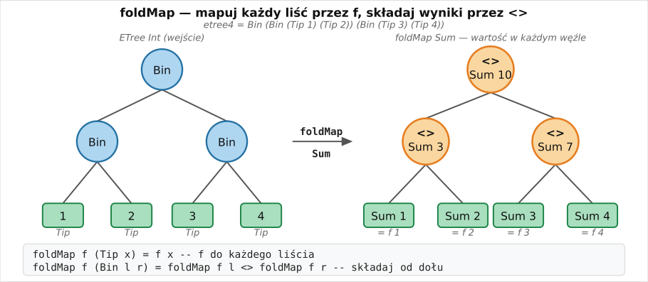
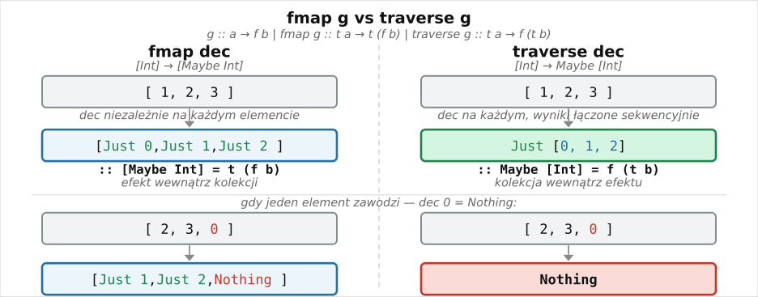
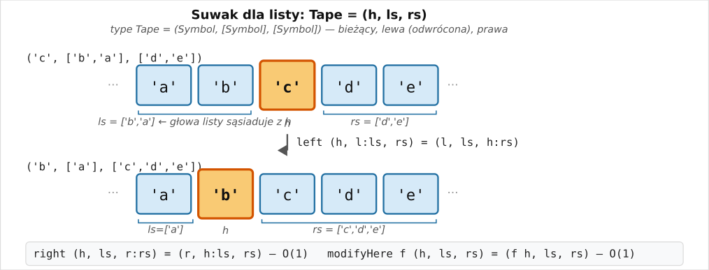
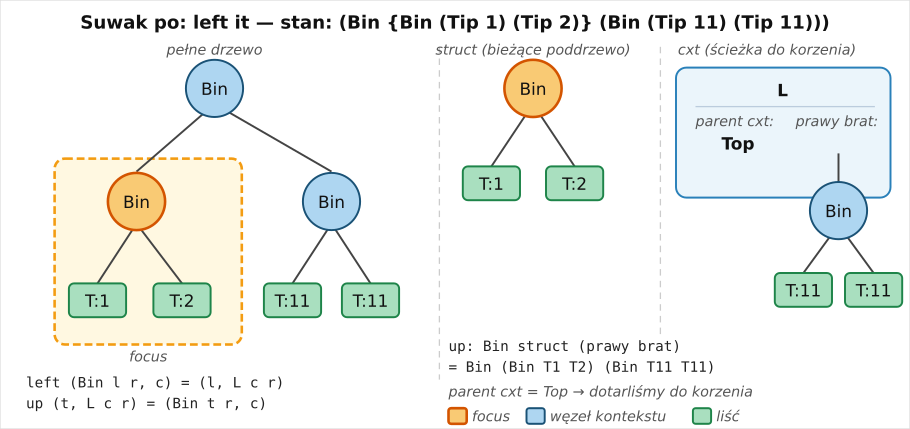
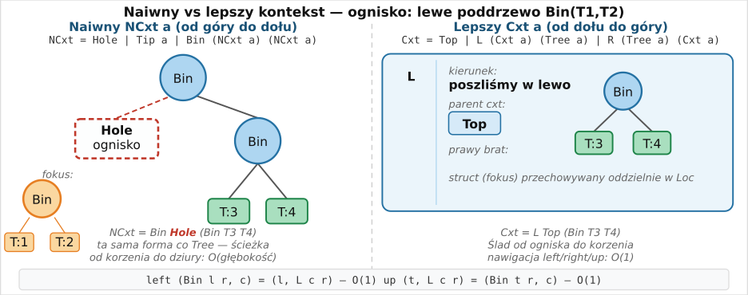

# Foldable, Traversable

Zajmiemy się teraz typowymi schematami przetwarzania struktur danych.

Tak jak poprzednio uogólniliśmy `map`, teraz uogólnimy `fold`
...a potem jeszcze raz `map`.

Wzorce projektowe są często opisywane przy uzyciu klas.
Omówimy teraz klasy

- Monoid (łączenie wyników)
- Foldable (transformacje czyste)
- Traversable (transformacje z efektami)

## ~~Star~~ Monoid Wars

Z klasą `Monoid` juz się zetknęliśmy, teraz zobaczymy ją w akcji


``` haskell
class Semigroup a where
  (<>) :: a -> a -> a

class Semigroup a => Monoid a where
  mempty :: a

  mappend :: a -> a -> a
  mappend = (<>)
```

 - `mappend` jest w klasie `Monoid` ze względu na wsteczną kompatybilność (kiedyś nie było odrębnej klasy `Semigroup`)


``` haskell
instance Semigroup [a] where
  (<>) = ( ++ )
```

Dla typów takich jak `Int` czy `Bool` jest więcej możliwości:
``` haskell
newtype Sum a = Sum {getSum :: a}
instance Num n => Semigroup (Sum n) where
  Sum x <> Sum y = Sum (x + y)

newtype All = All {getAll :: Bool}
instance Semigroup All where All a <> All b = All (a && b)

newtype Product a = Product {getProduct :: a}
newtype Any = Any {getAny :: Bool}
```

### ~~Empire~~ Endo strikes back

Ciekawym przypadkiem monoidu są endomorfizmy, to jest funkcje w obrębie danego typu

```haskell
newtype Endo a = Endo {appEndo :: a -> a}

Endo f <> Endo g = Endo (f . g)
mempty = Endo id
```

```haskell
>>> let computation = Endo ("Hello, " ++) <> Endo (++ "!")
>>> appEndo computation "Haskell"
"Hello, Haskell!"

>>> let computation = Endo (*3) <> Endo (+1)
>>> appEndo computation 1
6
```

za chwilę zobaczymy jak można je wykorzystać.

### Return of the ~~Jedi~~ Monoid
 Monoid pozwala na utworzenie jednej wartości na podstawie zawartości kolekcji
 (to co jest esencją funkcji typu `fold`);<br/>
 na przykład obliczenie sumy czy stworzenie listy elementów kolekcji.

Na przykład dla list moglibyśmy napisać


``` haskell
fold :: Monoid a => [a] -> a
fold [] = mempty
fold (x:xs) = x <> fold xs
-- fold = foldr (<>) mempty

ghci> fold ["Ala","bama"]
"Alabama"
```
niestety `fold [1..5]` nie zadziała, bo nie wiadomo jaką operację mamy na myśli.

Dlatego przyda się funkcja

``` haskell
foldMap :: Monoid b => (a -> b) -> [a] -> b

ghci> foldMap Product [1..5]
Product {getProduct = 120}
ghci> foldMap Sum [1,2,3]
Sum {getSum = 6}
```

## Foldable

Podobnie jak `fmap` uogólnia `map` na inne kolekcje, tak `Foldable` uogólnia `fold*`:

``` haskell
class Foldable t where
  fold :: Monoid m => t m -> m
  foldMap :: Monoid m => (a -> m) -> t a -> m
  foldr :: (a -> b -> b) -> b -> t a -> b
  foldl, foldl' :: (b -> a -> b) -> b -> t a -> b
  {-# MINIMAL foldMap | foldr #-}
```
(jest więcej metod, tu najważniejsze).

Na przykład dla drzew

```haskell
data ETree a = Tip a | Bin (ETree a) (ETree a) deriving (Show)

instance Foldable ETree where
    fold (Tip x) = x
    fold (Bin l r) = fold l <> fold r

    foldMap f (Tip x) = f x
    foldMap f (Bin l r) = foldMap f l <> foldMap f r
```

## Foldable Tree



``` haskell
ghci> etree4 = Bin (Bin (Tip 1) (Tip 2)) (Bin (Tip 3) (Tip 4))
ghci> foldMap Sum etree4
Sum {getSum = 10}
```

### Składane drzewo

```haskell
instance Foldable ETree where
    fold :: Monoid m => ETree m -> m
    fold (Tip x) = x
    fold (Bin l r) = fold l <> fold r

    foldMap :: Monoid m => (a -> m) -> ETree a -> m
    foldMap f (Tip x) = f x
    foldMap f (Bin l r) = foldMap f l <> foldMap f r

    foldr :: (a -> b -> b) -> b -> ETree a -> b
    foldr f v (Tip x) = f x v
    foldr f v (Bin l r) = foldr f (foldr f v r) l

    foldl :: (b -> a -> b) -> b -> ETree a -> b
    foldl f v (Tip x) = f v x
    foldl f v (Bin l r) = foldl f (foldl f v l) r
```

Dlaczego `foldl/foldr` wygladają w ten sposób?

A pamiętacie funkcję `flatten`?

### ~~The Force~~ Deforestation Awakens
pamiętacie funkcję `flatten`? A liniowe reverse?

``` haskell
-- revA xs ys = rev xs ++ ys
revA []     ys = ys
revA (x:xs) ys = revA xs (x:ys)
reverse xs = revA xs []

-- flatA t xs = flat t ++ xs
flatA :: ETree a -> [a] ->[a]
-- foldr f v (Tip x) = f x v
flatA (Tip x) xs = x:xs
-- foldr f v (Bin l r) = foldr f (foldr f v r) l
flatA (Bin l r) xs = flatA l (flatA r xs)

flatten :: ETree a -> [a]
flatten t = flatA t []

-- flatten = foldr (:) []
```

`Foldable` pozwala nam działać na kolekcjach jak na listach, bez przekształcania ich w listy (deforestacja) ...<br/>
...chociaż w każdej chwili możemy to łatwo zrobić.

```haskell
toList :: Foldable t => t a -> [a]
toList t = build (\ c n -> foldr c n t)  -- = foldr (:) [] t
```

Funkcja `toList` używa `build`, aby ułatwić ewentualną  zastosowanie reguły `foldr/build` (deforestacja).

### Revenge of the ~~Sith~~ List

`Foldable` pozwala nam działać na kolekcjach jak na listach:

``` haskell
etree4 = Bin (Bin (Tip 1) (Tip 2)) (Bin (Tip 3) (Tip 4))
ghci> length etree4
4
ghci> elem 3 etree4
True
ghci> maximum etree4
4
ghci> product etree4
24
```

...stąd na pierwszy rzut oka dziwne odpowiedzi `ghci` na pytanie o typy prostych funkcji:

``` haskell
ghci> :t length
length :: Foldable t => t a -> Int
```

### ` {-# MINIMAL foldMap | foldr #-}`

klasa `Foldable` ma wiele funkcji, ale wystarczy zaimplementowac jedną, inne dają się wyrazić za jej pomocą

```haskell
fold = foldMap id
toList = foldr (:) []          -- dla list to identyczność
length = foldl' (\c _ -> c+1) 0
```

### ` {-# MINIMAL foldMap | foldr #-}`

Trochę trudniejsza jest wzajemna wyrażalność `foldMap` i `foldr`

```haskell
foldMap :: Monoid b => (a -> b) -> t a -> b
foldMap f = foldr (mappend . f) mempty
-- f :: a -> b; mappend :: b -> (b -> b); mappend . f  :: a -> b -> b; mempty :: b

foldr :: (a -> b -> b) -> b -> t a -> b
foldr f z t = appEndo (foldMap (Endo . f) t) z
```
Implementacja `foldr` wykorzystuje monoid **Endo**:

- każdy element jest mapowany na jego działanie ($x\mapsto f\ x$); np dla `f = (+)` element `x` przechodzi na `(x+)`
- `foldMap` sklada je w jedną funkcję (w monoidzie **Endo** działaniem jest złożenie)
- ta funkcja jest stosowana do wartości `z`

(ilustracja poniżej)

### foldr via Endo
Implementacja `foldr` wykorzystuje monoid **Endo**:

- każdy element jest mapowany na jego działanie ($x\mapsto f\ x$); np dla `f = (+)` element `x` przechodzi na `(x+)`
- `foldMap` sklada je w jedną funkcję (w monoidzie **Endo** działaniem jest złożenie)
- ta funkcja jest stosowana do wartości `z`

![foldr via Endo: trzy kroki na przykładzie foldr (+) 0 [1,2,3]](w09endo-foldr.svg)

## Traversable

Poznaliśmy już `fmap`

``` haskell
class Functor t where
    fmap :: (a -> b) -> t a -> t b
```

jako uogólnienie `map`:

```haskell
map :: (a -> b) -> [a] -> [b]
map g [] = []
map g (x:xs) = (:) (g x) (map g xs)
```

Załóżmy teraz, że użycie `g` może się nie powieść (wynikiem jest **Maybe**).
Możemy sobie poradzić korzystając z **Applicative**:

```haskell
traverse :: (a -> Maybe b) -> [a] -> Maybe [b]
traverse g [] = pure []
traverse g (x:xs) = (:) <$> g x <*> traverse g xs
```
uwaga: `traverse g xs :: Maybe [b]` podczas gdy `fmap g xs :: [Maybe b]`;

### Traversable - przykład


``` haskell
class Functor t where
    fmap :: (a -> b) -> t a -> t b

traverse :: (a -> Maybe b) -> [a] -> Maybe [b]
traverse g [] = pure []
traverse g (x:xs) = (:) <$> g x <*> traverse g xs
```

```haskell
dec n = if n>0 then Just(n-1) else Nothing

>>> traverse dec [1,2,3]
Just [0,1,2]
>>> traverse dec [2,3,0]
Nothing
```



### Klasa Traversable

Klasa **Traversable** uogólnia ten schemat na inne kolekcje i przypadki **Applicative**:

```haskell
class (Functor t, Foldable t) => Traversable t where
  traverse :: Applicative f => (a -> f b) -> t a -> f (t b)
  traverse f = sequenceA . fmap f

  sequenceA :: Applicative f => t (f b) -> f (t b)
  sequenceA = traverse id  -- a ~ f b
```

Wystarczy zaimplementowac jedną z metod `traverse`, `sequenceA`

Domyślna implementacja `traverse f` dla każdego elementu `x` kolekcji wybiera akcję `f x`, wykonuje te akcje w kolejności i zbiera wyniki.

Skoro `f` jest konstruktorem obliczenia (efektu), a `t` konstruktorem kolekcji, to `f (t b)`
jest obliczeniem dającym kolekcję wyników.
<br/>(natomiast `t (f b)` jest kolekcją obliczeń)
```haskell
>>> sequenceA [Just 1, Just 2, Just 3]
Just [1,2,3]

>>> traverse Just [1,2,3]
Just [1,2,3]
```

Oczywiście, skoro **Monad** jest podklasą **Applicative**, to `sequenceA` działa też dla **Monad**. Ze względów historycznych istnieje funkcja
``` haskell
sequence :: (Traversable t, Monad m) => t (m a) -> m (t a)
```
będąca uogólnieniem funkcji

```
sequence :: Monad m => [m a] -> m [a]
```

### Trawers drzewa

```haskell
instance Traversable ETree where
    traverse :: Applicative f => (a -> f b) -> ETree a -> f (ETree b)
    traverse f (Tip x) = Tip <$> f x
    traverse f (Bin l r) = Bin <$> traverse f l <*> traverse f r

    sequenceA :: Applicative f => ETree (f a) -> f (ETree a)
    sequenceA (Tip x) = Tip <$> x
    sequenceA (Bin l r) = Bin <$> sequenceA l <*> sequenceA r

dec n | n > 0     = Just(n - 1)
      | otherwise = Nothing
      
-- >>> traverse dec (Bin (Tip 1) (Tip 2))
-- Just (Bin (Tip 0) (Tip 1))

-- >>> traverse dec (Bin (Tip 1) (Tip 0))
-- Nothing

-- >>> sequenceA (Bin (Tip (Just 1)) (Tip (Just 2)))
-- Just (Bin (Tip 1) (Tip 2))

-- >>> sequenceA (Bin (Tip (Just 1)) (Tip Nothing))
-- Nothing
```

# Modyfikacja struktur danych (1)

Mamy długą listę, np. reprezentującą taśmę maszyny Turinga

Chcemy zaimplementować operacje:

- przesuń się w lewo/prawo
- zmodyfikuj wartość w bieżącym miejscu

Naiwna implementacja: `Tape = ([Symbol], Int)` kosztowna modyfikacja


# Modyfikacja struktur danych (2)

Lepiej: bieżąca wartość, taśma na lewo, taśma na prawo

``` haskell
type Tape = (Symbol, [Symbol], [Symbol])

left, right :: Tape -> Tape
left (h, l:ls, rs) = (l, ls, h:rs)
right (h, ls, r:rs) = (r, h:ls, rs)

modifyHere :: (Symbol -> Symbol) -> Tape -> Tape
modifyHere f (h, ls, rs) = (f h, ls, rs)
```

Wszystkie operacje są w czasie stałym; ten pomysł można uogólnić na inne struktury danych.




# Zipper (Suwak)

Suwak (ang. `Zipper`) jest konstrukcją ułatwiającą nawigację w złożonych strukturach i ich lokalną modyfikację

``` haskell
ghci> start
{Bin (Bin (Tip 1) (Tip 2)) (Tip 7)}

ghci> right it
(Bin (Bin (Tip 1) (Tip 2)) {Tip 7})

ghci> modifyHere (const (Bin (Tip 3) (Tip 4))) it
(Bin (Bin (Tip 1) (Tip 2)) {Bin (Tip 3) (Tip 4)})

ghci> modifyHere ($> 11) it
(Bin (Bin (Tip 1) (Tip 2)) {Bin (Tip 11) (Tip 11)})

ghci> up it
{Bin (Bin (Tip 1) (Tip 2)) (Bin (Tip 11) (Tip 11))}

ghci> left it
(Bin {Bin (Tip 1) (Tip 2)} (Bin (Tip 11) (Tip 11)))

ghci> right it
(Bin (Bin (Tip 1) {Tip 2}) (Bin (Tip 11) (Tip 11)))
```
Nawiasy klamrowe `{ }` wskazują bieżącą pozycję.

(ilustracja poniżej)

# Zipper (Suwak)

``` haskell
...
{Bin (Bin (Tip 1) (Tip 2)) (Bin (Tip 11) (Tip 11))}

ghci> left it
(Bin {Bin (Tip 1) (Tip 2)} (Bin (Tip 11) (Tip 11)))

ghci> right it
(Bin (Bin (Tip 1) {Tip 2}) (Bin (Tip 11) (Tip 11)))
```
Nawiasy klamrowe `{ }` wskazują bieżącą pozycję.



``` haskell
ghci> struct = Bin (Tip 1) (Tip 2) :: Tree Int
ghci> sibling = Bin (Tip 11) (Tip 11) :: Tree Int
ghci> up (struct, L Top sibling)
(Bin (Bin (Tip 1) (Tip 2)) (Bin (Tip 11) (Tip 11)),Top)
```

## Implementacja

Naiwny kontekst (od góry do dołu)
```
data NCxt a = Hole | Tip a | Bin (NCxt a) (NCxt a)   -- ~ Tree (Maybe a)
```

Lepszy kontekst (od dołu do góry)

``` haskell
data Cxt a = Top | L (Cxt a) (Tree a) | R (Tree a) (Cxt a)
```
Kontekst *L c r* oznacza "jesteśmy w lewym poddrzewie, nad nami jest kontext *c* natomiast prawym bratem jest *r*"



## Implementacja

**Lokalizacja** (drzewo w kontekście)

``` haskell
type Loc a = (Tree a, Cxt a)

modifyHere :: (Tree a -> Tree a) -> Loc a -> Loc a
modifyHere f (e, c) = (f e, c)  -- modyfikuje poddrzewo w czasie stałym                   
```

**Nawigacja**
``` haskell
top :: Tree a -> Loc a
top t = (t, Top)

left, right, up :: Loc a -> Loc a
left  (Bin l r, c) = (l, L c r)
right (Bin l r, c) = (r, R l c)

up (t, L c r) = (Bin t r, c)
up (t, R l c) = (Bin l t, c)
```

## Alternatywna prezentacja

Równoważną (w pewnym sensie dualną) reprezentacją
jest opis ścieżki od korzenia zawierający kierunki ruchu<br/>oraz mijane po drodze poddrzewa:

``` haskell
data Dir = DL | DR deriving (Show, Eq)
type Path a = [(Dir, Tree a)]
type Foc a = (Tree a, Path a)
```
Podstawowa różnica polega na tym, że suwak przechowuje ścieżkę w odwrotnej kolejności, co usprawnia nawigację.

Ponadto dostęp do wyróżnonego węzła wymaga tu przejścia ściezki (a w suwaku nie).

Napisz funkcje przekształcające pomiedzy tymi reprezentacjami

``` haskell
toFoc   :: Loc a -> Foc a
fromFoc :: Foc a -> Loc a
```

## Ćwiczenia

1. Napisz funkcję `showLoc` wypisującą drzewa z lokalizacją jak widzieliśmy wcześniej

``` haskell
(Bin (Bin (Tip 1) (Tip 2)) {Tip 7})
```

(instancja `Show` wymagałaby dodania pragmy `{-# OVERLAPPING #-}` )

2. Stwórz zipper dla typu wyrażeń

``` haskell
data Expr = Var Name
          | Con Name
          | Expr :$ Expr
          | IntLit Integer
```

można też użyć typu parametryzowanego:

``` haskell
type Expr = Exp Name
data Exp a = Var a
           | Con a
           | Exp a :$ Exp a
           | IntLit Integer
```

# Monadyczny Zipper

Obliczenia ze zmienną pozycją w strukturze są rodzajem obliczeń ze stanem

``` haskell
data Loc c a = Loc { struct :: a,
                     cxt    :: c }
             deriving (Show, Eq)

type Travel loc a = State loc a

travel :: Loc c a              -- starting location (initial state)
         -> Travel (Loc c a) a -- locational computation to use
         -> a                  -- resulting substructure
travel start tt = evalState tt start
```

Miejsca i kierunki będą specyficzne dla struktury danych, ale niektóre operacje są generyczne:

``` haskell
-- modify the substructure at the current node
modifyStruct :: (a -> a) -> Travel (Loc c a) a
modifyStruct f = modify editStruct >> gets struct where
    editStruct (Loc s c) = Loc (f s) c

-- put a new substructure at the current node
putStruct :: a -> Travel (Loc c a) a
putStruct t = modifyStruct $ const t

-- get the current substructure
getStruct :: Travel (Loc c a) a
getStruct = modifyStruct id     -- works because modifyTree returns the 'new' tree
```

## Podróże po drzewie

``` haskell
data Cxt a = Top
           | L (Cxt  a) (Tree a)
           | R (Tree a) (Cxt  a)
             deriving (Show)

type TreeLoc    a = Loc (Cxt a) (Tree a)
type TravelTree a = Travel (TreeLoc a) (Tree a)


-- move down a level, through the left branch
left :: TravelTree a
left = modify left' >> gets struct where
    left' (Loc (Tip _    ) _) = error "Down from leaf"
    left' (Loc (Bin l r) c) = Loc { struct = l,
                                    cxt    = L c r }

-- move down a level, through the left branch
right :: TravelTree a
right = modify right' >> gets struct where
    right' (Loc (Tip _    ) _) = error "Down from leaf"
    right' (Loc (Bin l r) c) = Loc { struct = r,
                                     cxt    = R l c }

-- move to a node's parent
up :: TravelTree a
up = modify up' >> gets struct where
    up' (Loc _     Top) = error "Up from top"
    up' (Loc t (L c r)) = Loc { struct = Bin t r, cxt = c }
    up' (Loc t (R l c)) = Loc { struct = Bin l t, cxt = c }

-- move to the top node
top :: TravelTree a
top = while (liftM isChild get) up >> liftM struct get
```

# The End(o)


``` haskell

```
